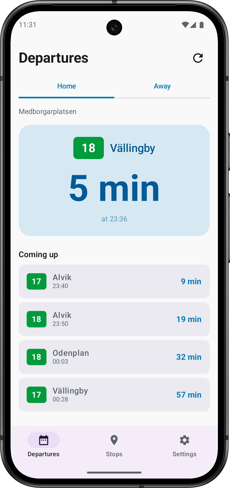
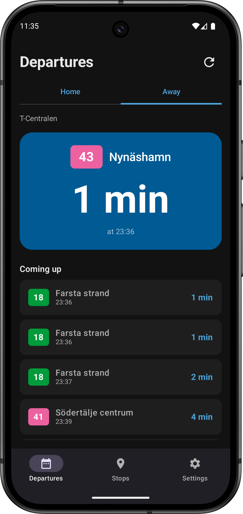
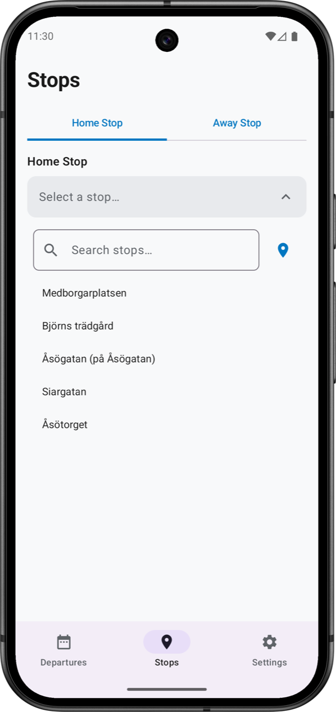
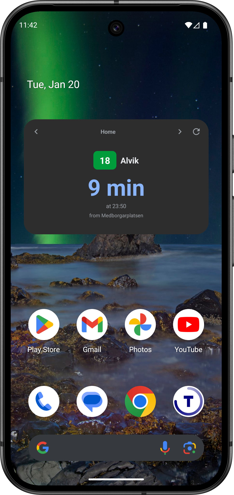
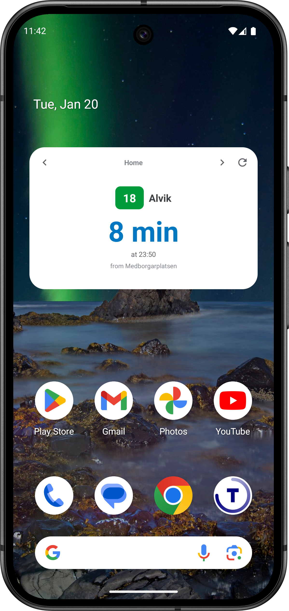

<a href="../sv/">🇸🇪 Svenska</a>

**Stockholm T-Minus shows you exactly how many minutes until your next bus, train, or metro arrives — right on your home screen.**

<h3 style="color: white; margin-top: 0;">🚀 Get Early Access</h3>

Stockholm T-Minus is launching soon. Join our exclusive beta program to try the app before anyone else — and help shape its future with your feedback.

<a href="https://groups.google.com/g/stockholm-t-minus" style="display: inline-block; padding: 12px 30px; background: white; color: #0077C1; text-decoration: none; border-radius: 8px; font-size: 1.1em; font-weight: bold;">
Join Beta Program →
</a>

---

## Features

### 🚇 Real-Time Departures
See live departure times from any SL stop in Stockholm. Times update automatically and count down in real-time.

### 📍 Find Nearby Stops
Use your location to discover transit stops around you. No more guessing which stop is closest.

### ⭐ Save Your Favorites
Save up to three stops for quick access — Home, Work, and an optional third location. Perfect for your daily commute.

### ✏️ Custom Station Names
Rename your stations to anything you want — "Work", "Gym", "School", or whatever makes sense to you. Custom names appear in the app and widget.

### 🎯 Filter by Line
Only care about certain lines? Filter departures to show just the buses or trains you actually take.

### 📱 Home Screen Widget
Add a widget to see departures without opening the app. Swipe between your saved stops right from your home screen.

### 🌐 Swedish & English
Full support for both Swedish and English interfaces.

---

## Screenshots

### Departures
See your next departure at a glance with the countdown timer. Switch between your saved stops with a tap or swipe.

| Light Mode | Dark Mode |
|:---:|:---:|
|  |  |

### Stop Configuration
Set your walk time to filter out departures you can't catch. Select exactly which lines and directions you care about.

| Stop Search | Line Filter |
|:---:|:---:|
|  |  |

### Home Screen Widget
Check departures without opening the app. The widget updates automatically and shows your next departure with a countdown.

| Dark Mode | Light Mode |
|:---:|:---:|
|  |  |

---

## Download

**Google Play:** *Coming soon* — [Join the beta program](https://groups.google.com/g/stockholm-t-minus) to try the app before launch!

---

## FAQ

### Which transit systems are supported?
Stockholm T-Minus works with all SL (Storstockholms Lokaltrafik) services including:
- Tunnelbana (metro)
- Pendeltåg (commuter rail)
- Buses
- Trams
- Light rail (Tvärbanan, Roslagsbanan, etc.)
- Ferries

### Does it work outside Stockholm?
No. The app only covers the SL network in the Stockholm region. It does not include other Swedish transit systems.

### Why do some stops not appear in search?
The app only shows stops that have actual departures. If a stop doesn't appear, it may be temporarily closed or not have any scheduled services in the next 24 hours.

### How accurate are the departure times?
Departure times come directly from SL's real-time API. The accuracy depends on SL's data — the app displays exactly what SL reports.

### Why do I only see a few upcoming departures per line?
The app can only display up to 3 upcoming departures per line and direction. This is a limitation of the data SL provides, not the app itself.

### Does the app work offline?
No. Stockholm T-Minus requires an internet connection to fetch real-time departure data. There is no offline mode.

### Why does the widget sometimes show old data?
Android limits how often widgets can update to preserve battery life. Tap the refresh button to make sure you're getting the latest data.

### Can I add more than two stops?
Yes! Tap the + button in the Stops tab to add an optional third stop. You can also rename any stop by editing the "Label" field — for example "Gym", "School", or "Partner's Place". Your custom names appear in the tabs and on the widget.

### Can I plan a trip with this app?
No. Stockholm T-Minus shows departures from specific stops only. For trip planning (A to B routing), use the official SL app or website.

### Is my location data shared?
No. Location data is only used to find nearby stops and is never stored, transmitted to servers, or shared with anyone. See our [Privacy Policy](privacy-policy) for details.

### Is this an official SL app?
No. Stockholm T-Minus is an independent app and is not affiliated with SL or Region Stockholm. Departure data is provided via the public [Trafiklab](https://www.trafiklab.se/) APIs.

---

## Privacy

We collect minimal data. See our [Privacy Policy](privacy-policy).

---

## Support & Feedback

Found a bug? Have a feature request? Please provide feedback here: [https://forms.gle/HabDkkv2QY1cDrgz9](https://forms.gle/HabDkkv2QY1cDrgz9)

---

## Attribution

Departure data provided by [Trafiklab](https://www.trafiklab.se/) using SL's public APIs.

---

*Stockholm T-Minus is not affiliated with SL (Storstockholms Lokaltrafik). SL is a trademark of Region Stockholm.*
