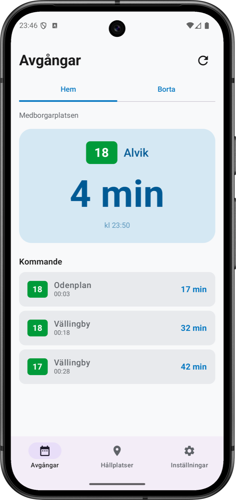
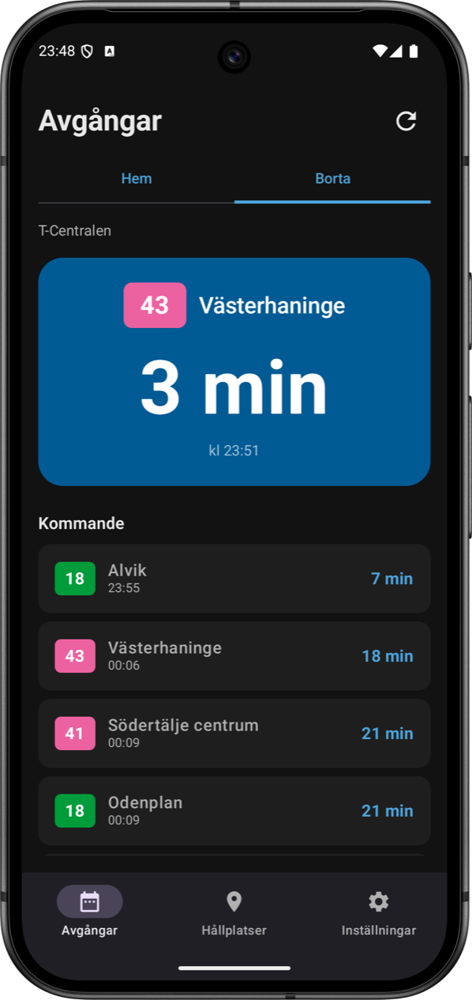
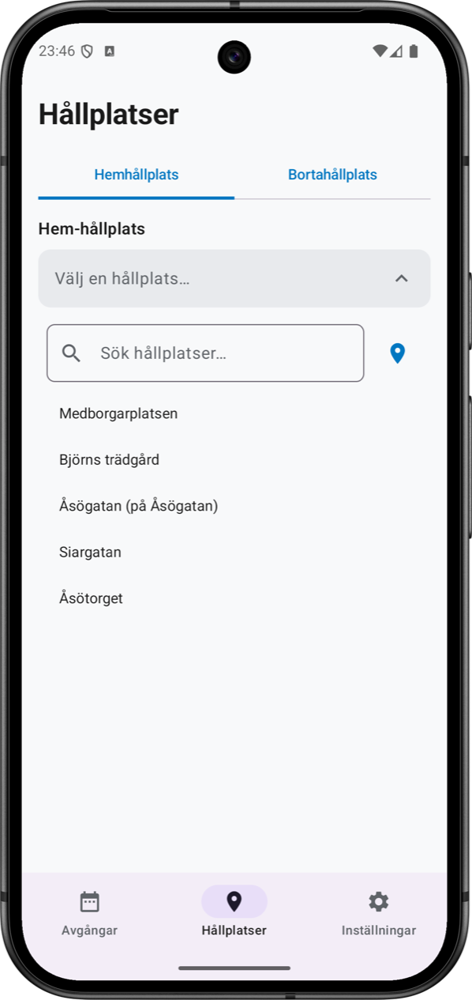
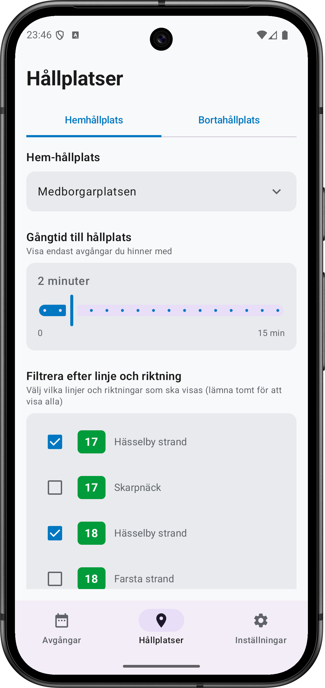
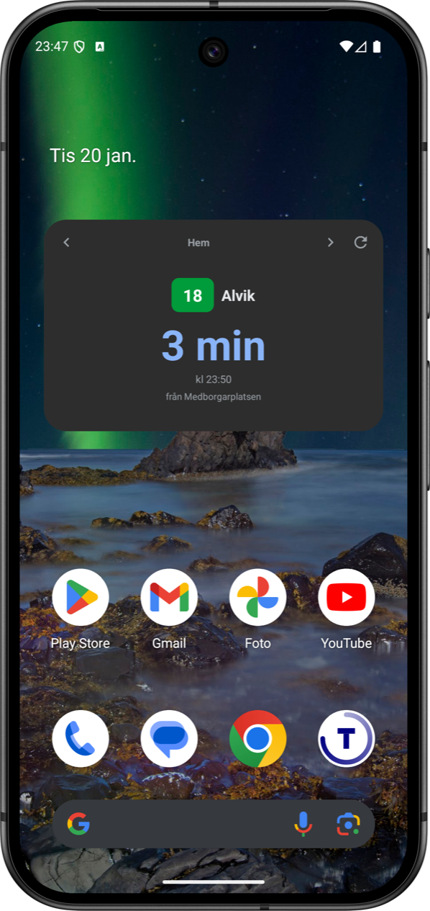
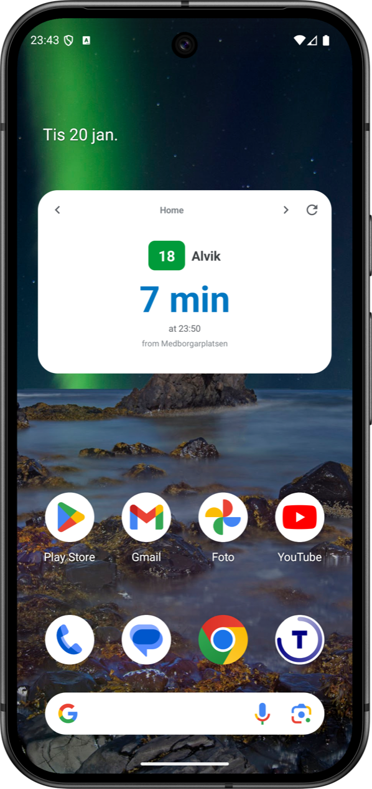

<a href="../en/">🇬🇧 English</a>

**Stockholm T-Minus visar exakt hur många minuter det är kvar tills din nästa buss, tåg eller tunnelbana avgår — direkt på din hemskärm.**

---

## Funktioner

### 🚇 Avgångar i realtid
Se aktuella avgångstider från alla SL-hållplatser i Stockholm. Tiderna uppdateras automatiskt och räknas ner i realtid.

### 📍 Hitta hållplatser nära dig
Använd din plats för att hitta hållplatser i närheten. Slipp gissa vilken hållplats som är närmast.

### ⭐ Spara dina favoriter
Spara de hållplatser du använder mest för snabb åtkomst. Perfekt för din dagliga pendling.

### 🎯 Filtrera efter linje
Bryr du dig bara om vissa linjer? Filtrera avgångarna så att du bara ser de bussar eller tåg du faktiskt åker med.

### 📱 Widget på hemskärmen
Lägg till en widget för att se avgångar utan att öppna appen. Svep mellan dina sparade hållplatser direkt från hemskärmen.

### 🌐 Svenska och engelska
Fullt stöd för både svenska och engelska gränssnitt.

---

## Skärmbilder

### Avgångar
Se din nästa avgång direkt med nedräkning. Växla mellan Hem och Borta-hållplatser med ett tryck.

| Ljust läge | Mörkt läge |
|:---:|:---:|
|  |  |

### Hållplatsinställningar
Ställ in din gångtid för att filtrera bort avgångar du inte hinner med. Välj exakt vilka linjer och riktningar du bryr dig om.

| Sök hållplats | Linjefilter |
|:---:|:---:|
|  |  |

### Widget på hemskärmen
Kolla avgångar utan att öppna appen. Widgeten uppdateras automatiskt och visar din nästa avgång med nedräkning.

| Mörkt läge | Ljust läge |
|:---:|:---:|
|  |  |

---

## Ladda ner

**Google Play:** *Kommer snart*

---

## Vanliga frågor

### Vilka trafikslag stöds?
Stockholm T-Minus fungerar med alla SL:s (Storstockholms Lokaltrafik) trafikslag:
- Tunnelbana
- Pendeltåg
- Bussar
- Spårvagnar
- Lokalbanor (Tvärbanan, Roslagsbanan, m.fl.)
- Pendelbåtar

### Fungerar appen utanför Stockholm?
Nej. Appen täcker endast SL:s nätverk i Stockholmsregionen. Den inkluderar inte andra svenska kollektivtrafiksystem.

### Varför visas inte vissa hållplatser i sökningen?
Appen visar endast hållplatser som har faktiska avgångar. Om en hållplats inte visas kan den vara tillfälligt stängd eller sakna planerad trafik de närmaste 24 timmarna.

### Hur exakta är avgångstiderna?
Avgångstiderna kommer direkt från SL:s realtids-API. Noggrannheten beror på SL:s data — appen visar exakt vad SL rapporterar.

### Varför ser jag bara ett fåtal kommande avgångar per linje?
Appen kan endast visa upp till 3 kommande avgångar per linje och riktning. Detta är en begränsning i den data som SL tillhandahåller, inte i appen själv.

### Fungerar appen offline?
Nej. Stockholm T-Minus kräver internetanslutning för att hämta realtidsdata. Det finns inget offline-läge.

### Varför visar widgeten ibland gammal data?
Android begränsar hur ofta widgets kan uppdateras för att spara batteri. Tryck på uppdateringsknappen för att säkerställa att du får den senaste datan.

### Kan jag planera en resa med appen?
Nej. Stockholm T-Minus visar endast avgångar från specifika hållplatser. För reseplanering (A till B) använd SL:s officiella app eller webbplats.

### Delas min platsdata?
Nej. Platsdata används endast för att hitta närliggande hållplatser och lagras aldrig, skickas inte till servrar eller delas med någon. Se vår [Integritetspolicy](privacy-policy) för detaljer.

### Är detta en officiell SL-app?
Nej. Stockholm T-Minus är en oberoende app och är inte ansluten till SL eller Region Stockholm. Avgångsdata tillhandahålls via de publika [Trafiklab](https://www.trafiklab.se/)-API:erna.

---

## Integritet

Vi samlar in minimal data. Se vår [Integritetspolicy](privacy-policy).

---

## Support och feedback

Hittat en bugg? Har du ett funktionsförslag? Lämna feedback här: [https://forms.gle/HabDkkv2QY1cDrgz9](https://forms.gle/HabDkkv2QY1cDrgz9)

---

## Attribution

Avgångsdata tillhandahålls av [Trafiklab](https://www.trafiklab.se/) via SL:s publika API:er.

---

*Stockholm T-Minus är inte anslutet till SL (Storstockholms Lokaltrafik). SL är ett varumärke som tillhör Region Stockholm.*
